# 나만의 프롬프트 관리 프로그램

Codyssey A1-1 미션 산출물입니다. 파이썬 콘솔 프로그램으로 프롬프트를 추가하고, 목록 확인, 카테고리 조회, 검색, 상세 보기, 즐겨찾기 관리, 수정/삭제, 조회수 기록, JSON 저장, Markdown 내보내기를 할 수 있습니다.

## 제출 정보

- GitHub 저장소: https://github.com/hongbinwee/codyssey-A1
- 미션 폴더: `A1-1/`
- 실행 파일: `main_a1_1.py`
- 스크린샷 폴더: `스크린샷/`

## 실행 방법

작업공간 루트에서 아래 명령어를 실행합니다.

```bash
cd A1-1
python3 main_a1_1.py
```

문법 검증:

```bash
cd A1-1
PYTHONPYCACHEPREFIX=/tmp/codyssey-a1-pycache python3 -m py_compile main_a1_1.py
```

## 주요 기능

- 프롬프트 추가
- 전체 프롬프트 목록 보기
- 카테고리별 조회
- 제목/내용 키워드 검색
- 프롬프트 상세 보기
- 즐겨찾기 추가 및 해제
- 즐겨찾기 목록 보기
- 프롬프트 수정 및 삭제
- 상세 보기 조회수 기록
- 조회수 Top 목록 보기
- JSON 파일 저장 및 불러오기
- 카테고리별 Markdown 파일 내보내기
- 프롬프트 내용 여러 줄 입력
- 중복 제목 입력 방지
- 잘못된 번호 및 빈 입력 안내

## 기본 데이터

프로그램 시작 시 기본 프롬프트 3개가 등록됩니다.

- 텍스트 생성: 블로그 글 작성 도우미
- 이미지 생성: 제품 썸네일 이미지 프롬프트
- 자동화: 뉴스 요약 자동화 프롬프트

데이터는 리스트와 딕셔너리로 관리하며, `prompts.json` 파일로 저장하고 다시 불러옵니다. 저장 파일이 없으면 기본 데이터로 시작합니다.

프롬프트 내용을 입력할 때는 여러 줄을 사용할 수 있습니다. 내용 입력을 마치려면 한 줄에 `.`만 입력합니다.

## 요구사항 대응표

| 미션 요구사항 | 반영 내용 |
| --- | --- |
| Python 3.10 이상 사용 | Python 버전 확인 스크린샷 포함 |
| 콘솔 메뉴 기반 프로그램 | `main_a1_1.py` 실행 시 번호 선택 메뉴 제공 |
| 기본 프롬프트 3개 이상 | 기본 데이터 3개 포함 |
| 프롬프트 추가 | 제목, 내용, 카테고리 입력 후 등록 |
| 여러 줄 내용 입력 | 내용 입력 완료 시 한 줄에 `.` 입력 |
| 프롬프트 목록 | 번호, 카테고리, 제목, 즐겨찾기 표시 |
| 카테고리별 조회 | 선택한 카테고리의 프롬프트만 출력 |
| 검색 | 제목 또는 내용 키워드 검색 |
| 상세 보기 | 선택한 번호의 전체 내용 출력 |
| 즐겨찾기 관리 | 즐겨찾기 추가/해제 및 목록 보기 |
| 잘못된 입력 처리 | 빈 입력, 잘못된 번호, 잘못된 카테고리 안내 |
| 함수 분리 | 기능별 함수로 코드 구성 |
| Git 커밋 10개 이상 | 기능 단위 커밋 10개 이상 생성 |
| 브랜치 생성 및 병합 | `feature/a1-1-list-view` 브랜치 생성 후 `main`에 병합 |
| GitHub 업로드 | `origin/main`에 push 완료 |
| Git 환경 확인 | Git 버전과 사용자 정보(`user.name`, `user.email`) 설정 확인 |
| 샘플 저장소 clone | 공개 샘플 저장소 clone 후 폴더 구조와 로그 확인 |
| 보너스 1: JSON 영속화 | `prompts.json` 저장 및 프로그램 시작 시 불러오기 |
| 보너스 1: Markdown 내보내기 | `exports/prompts_by_category.md` 파일 생성 |
| 보너스 2: 수정/삭제 | 메뉴에서 프롬프트 수정 및 삭제 가능 |
| 보너스 2: 사용 기록 | 상세 보기 시 조회수 증가 |
| 보너스 2: Top 목록 | 조회수 기준으로 프롬프트 정렬 출력 |

## 코드 구조

- `create_default_prompts()`: 기본 프롬프트 데이터 생성
- `load_prompts()`: JSON 파일에서 프롬프트 불러오기
- `save_prompts()`: 프롬프트 목록을 JSON 파일로 저장
- `show_menu()`: 메뉴 출력
- `add_prompt()`: 프롬프트 추가
- `show_list()`: 전체 목록 출력
- `show_categories()`: 카테고리별 조회
- `search_prompt()`: 키워드 검색
- `show_prompt_detail()`: 상세 보기
- `edit_prompt()`: 프롬프트 수정
- `delete_prompt()`: 프롬프트 삭제
- `toggle_favorite()`: 즐겨찾기 추가/해제
- `show_favorites()`: 즐겨찾기 목록 출력
- `show_top_prompts()`: 조회수 기준 Top 목록 출력
- `export_prompts_to_markdown()`: 카테고리별 Markdown 내보내기

## Git 작업 요약

- `main_a1_1.py` 기준으로 기능 단위 커밋을 쌓았습니다.
- `feature/a1-1-list-view` 브랜치에서 목록 기능을 구현한 뒤 `main`으로 병합했습니다.
- 최종 Git 로그는 `스크린샷/07-final-git-log-graph.png`에서 확인할 수 있습니다.
- `git --version`, `git config user.name`, `git config user.email` 명령으로 Git 버전과 사용자 정보를 확인했습니다.

샘플 저장소 clone 확인:

```text
cd Desktop
git clone https://github.com/octocat/Hello-World.git
cd Hello-World
git log --oneline

Cloning into 'Hello-World'...
remote: Enumerating objects: 13, done.
remote: Total 13 (delta 0), reused 0 (delta 0), pack-reused 13
Receiving objects: 100% (13/13), done.

7fd1a60 Merge pull request #6 from Spaceghost/patch-1
762941b Update README
553c207 first commit
```

`git clone`으로 원격 저장소를 내려받고, `git log --oneline`으로 커밋 기록을 확인하는 과정을 실습했습니다. 샘플 저장소는 확인 후 삭제했습니다.

## Git 커밋 및 브랜치 기록

| 항목 | 내용 |
| --- | --- |
| 기본 브랜치 | `main` |
| 원격 저장소 | `origin https://github.com/hongbinwee/codyssey-A1.git` |
| 전체 커밋 수 | 24개 이상 |
| 기능 작업 브랜치 | `feature/a1-1-list-view` |
| 병합 커밋 | `1bae160 merge: add prompt list feature` |
| 최종 push 상태 | `main`과 `origin/main` 동기화 완료 |

주요 기능 단위 커밋:

- `deb6dcf chore: start a1-1 script entrypoint`
- `a7c6334 feat: add default prompt data`
- `8c9e152 feat: implement prompt creation`
- `1bf93c6 feat: render prompt list`
- `d36c18b feat: filter prompts by category`
- `2ea6132 feat: search prompts by keyword`
- `bce82d9 feat: show prompt details`
- `3e0a11b feat: toggle prompt favorites`
- `cfa189b feat: list favorite prompts`
- `7ded147 fix: improve prompt input validation`

브랜치 작업 흐름:

```text
main
  -> feature/a1-1-list-view 생성
  -> 프롬프트 목록 기능 구현
  -> main으로 병합
```

## 제출 스크린샷

### 1. Python 버전 확인 및 Hello 실행

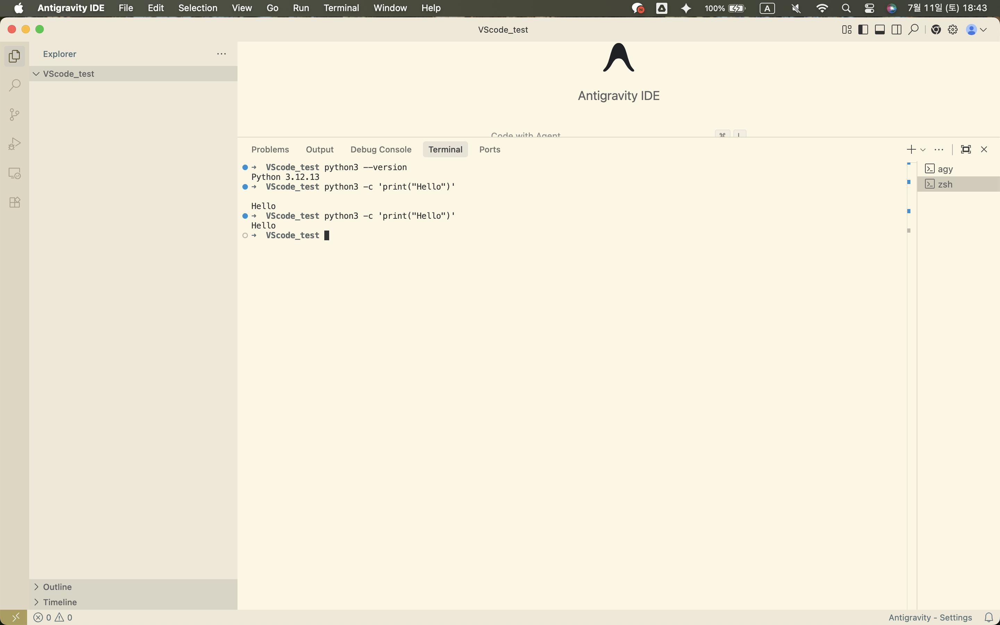

### 2. Git 저장소 초기화 및 원격 저장소 연결

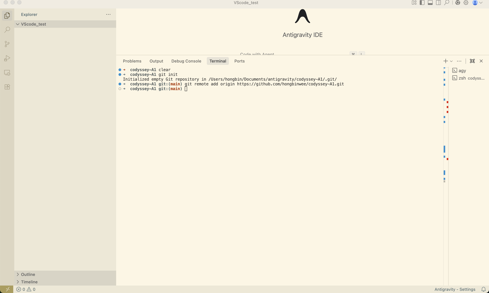

### 3. Git commit/log 연습

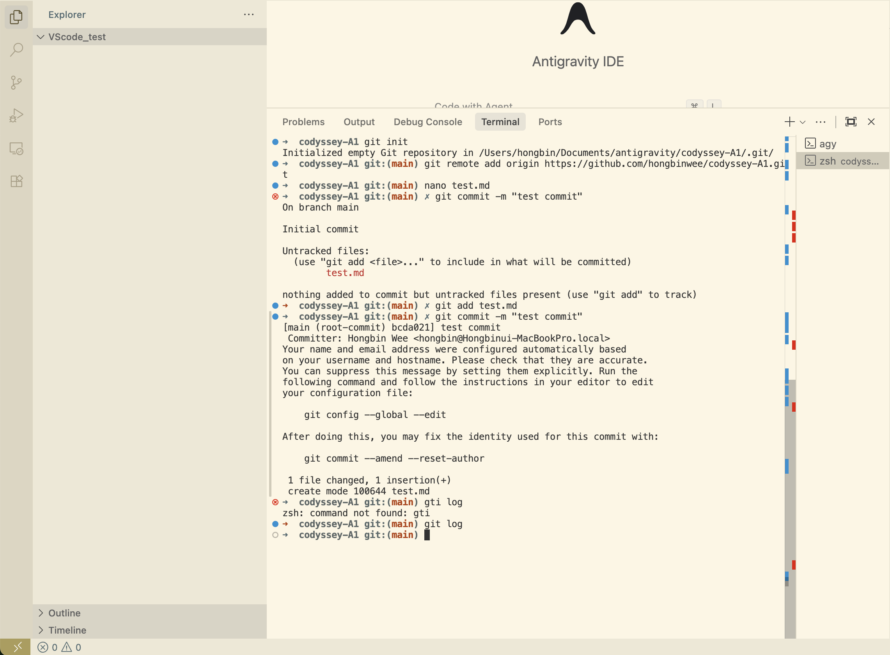

### 4. 원격 저장소 push 및 upstream 설정

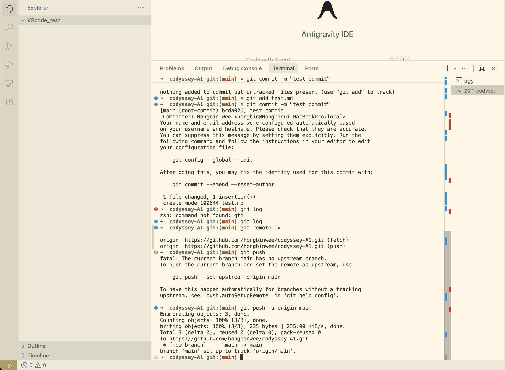

### 5. .gitignore, README 작성 및 push

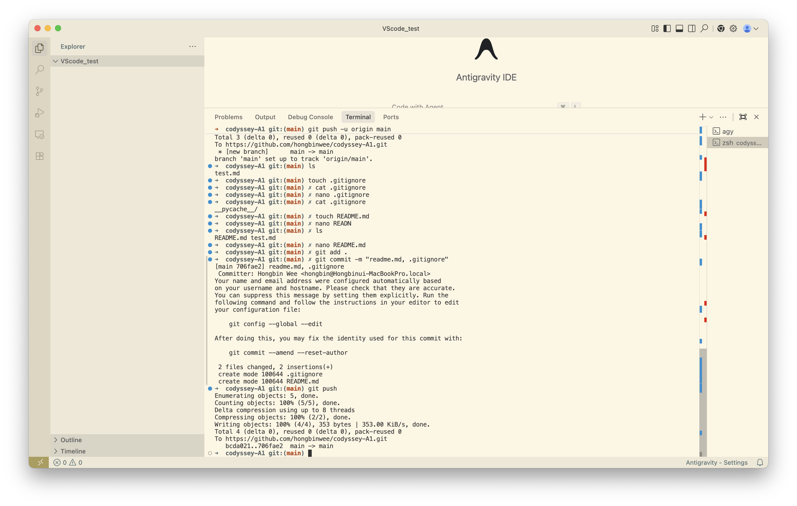

### 6. GitHub 저장소 화면

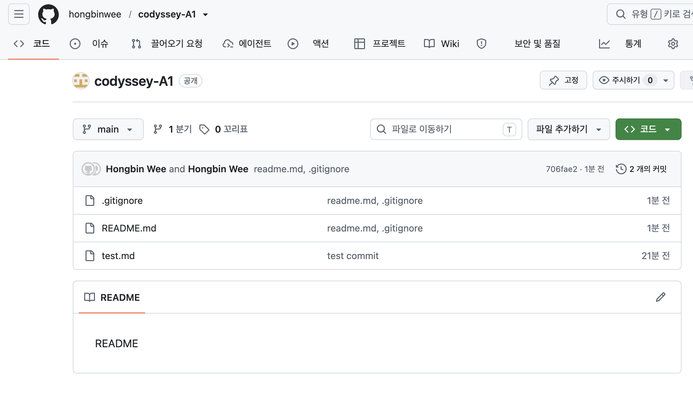

### 7. 최종 git log 그래프

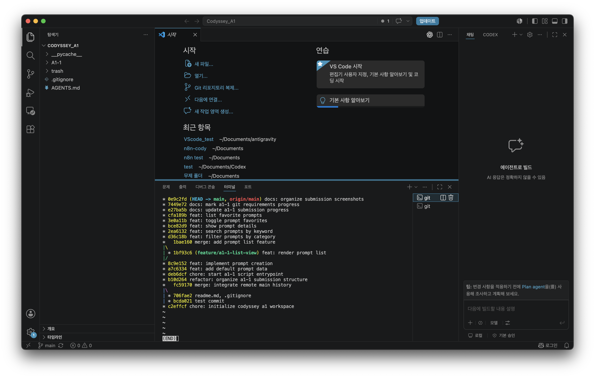

### 8. 프로그램 메뉴 화면

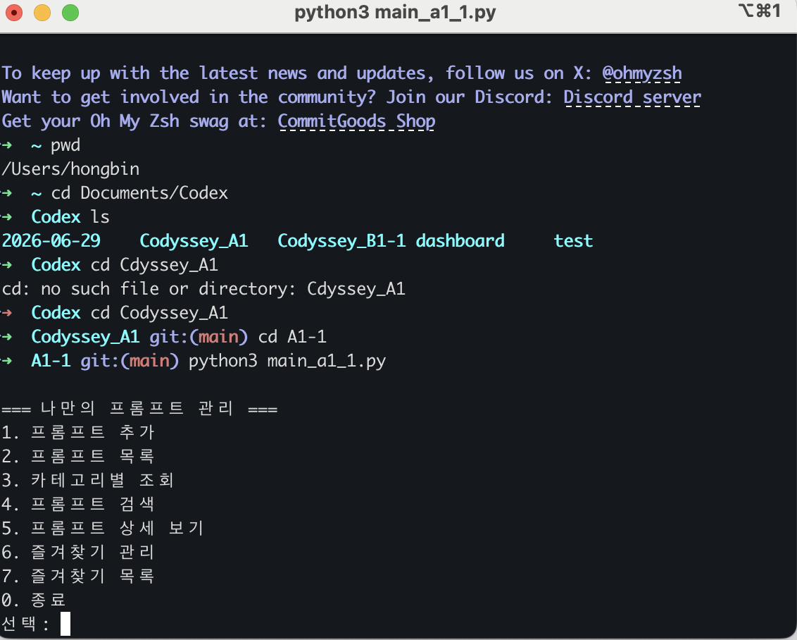

### 9. 프롬프트 추가 후 목록 화면

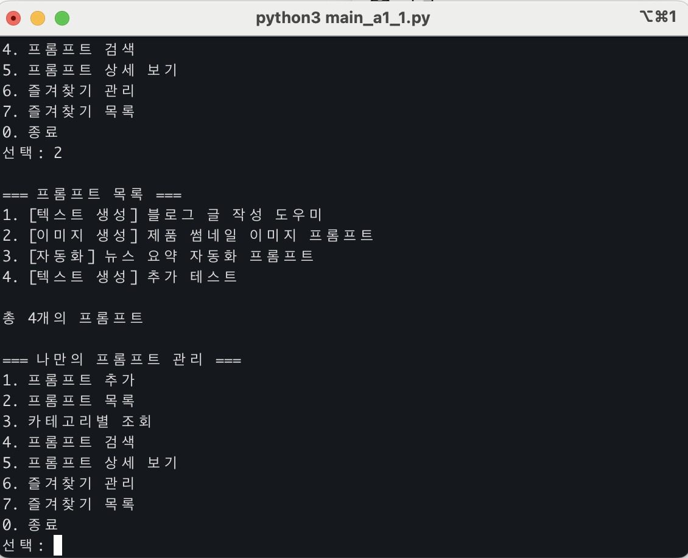

### 10. 프롬프트 목록 화면

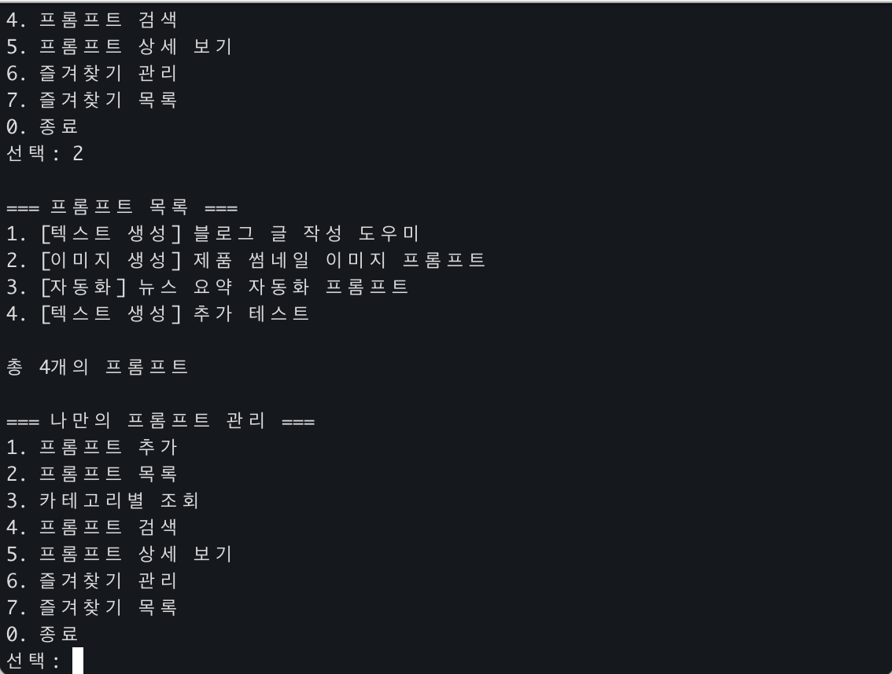

### 11. 프롬프트 검색 결과 화면

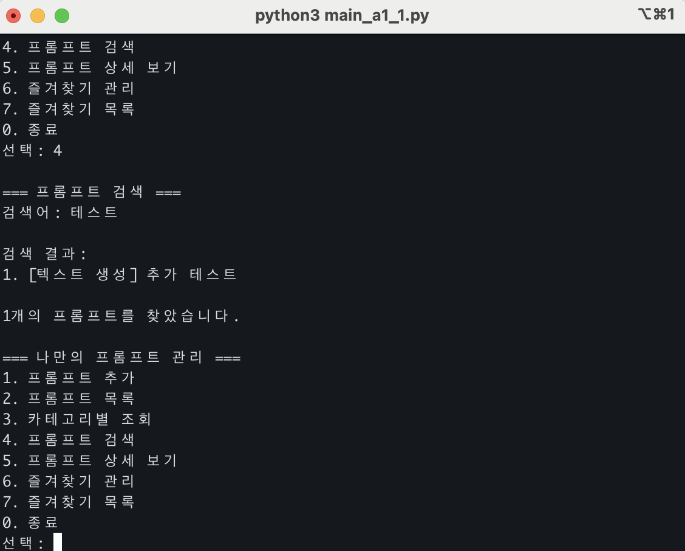

### 12. 즐겨찾기 목록 화면

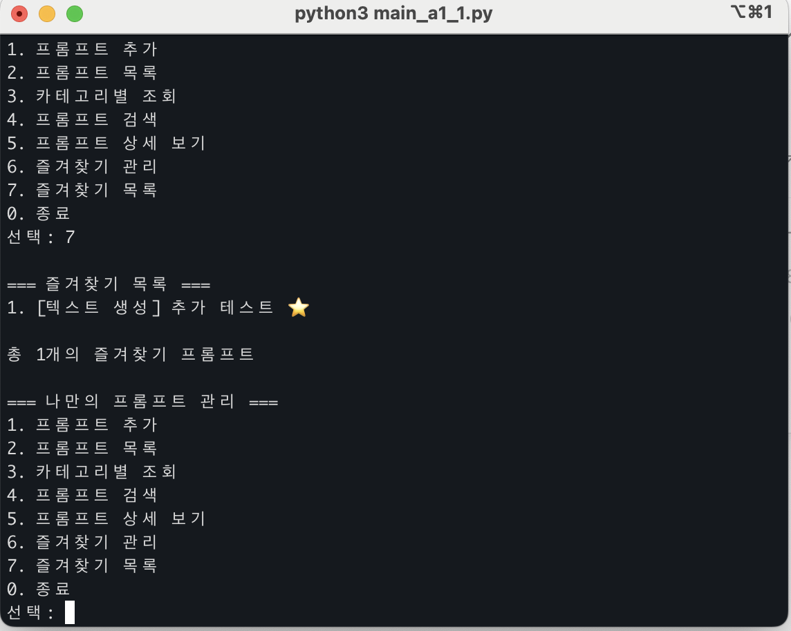

## 제출 전 최종 확인

- 프로그램 실행 결과 스크린샷 포함 완료
- 개발 환경 설정 스크린샷 포함 완료
- 최종 Git 로그 스크린샷 포함 완료
- GitHub 저장소 URL과 실행 방법 기재 완료

## 인터뷰 대비 정리

### 데이터 영속화

현재 프로그램은 프롬프트를 리스트와 딕셔너리로 관리하고, 변경된 데이터를 `prompts.json` 파일에 저장합니다. 프로그램 시작 시 `load_prompts()`가 JSON 파일을 읽고, 파일이 없거나 형식이 올바르지 않으면 기본 데이터로 시작합니다. JSON은 현재 사용 중인 리스트와 딕셔너리 구조를 그대로 표현하기 쉬워 이 프로그램에 적합합니다.

### 병합 충돌 해결 순서

브랜치 병합 중 충돌이 발생하면 먼저 충돌이 난 파일을 열어 어떤 코드가 겹쳤는지 확인합니다. 그다음 필요한 코드만 남기고 충돌 표시를 제거한 뒤 프로그램을 실행해 기능이 정상 동작하는지 검증합니다. 문제가 없으면 수정한 파일을 `git add` 하고 충돌 해결 커밋을 남깁니다.

### 카테고리 변경 대응

카테고리 목록은 `main_a1_1.py`의 `PROMPT_CATEGORIES`에 모아두었습니다. 카테고리를 추가하거나 수정할 때는 이 리스트를 먼저 수정하는 것이 가장 안전합니다. 프롬프트 추가와 카테고리별 조회가 같은 목록을 사용하므로 카테고리 기준을 한 곳에서 관리할 수 있습니다.
